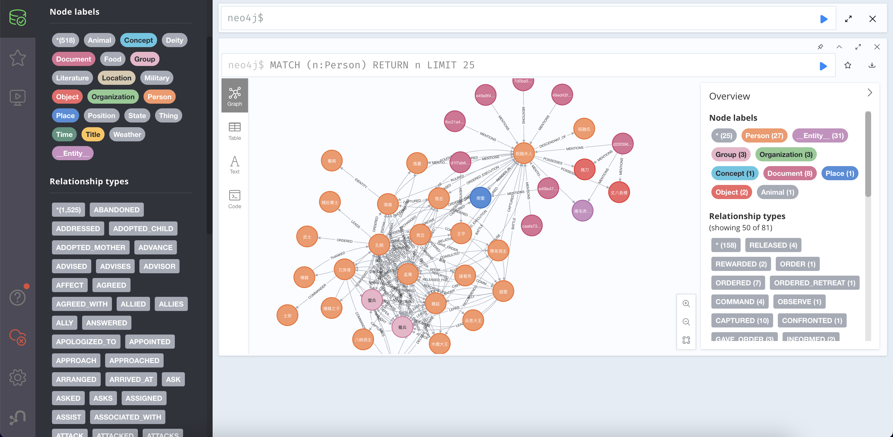
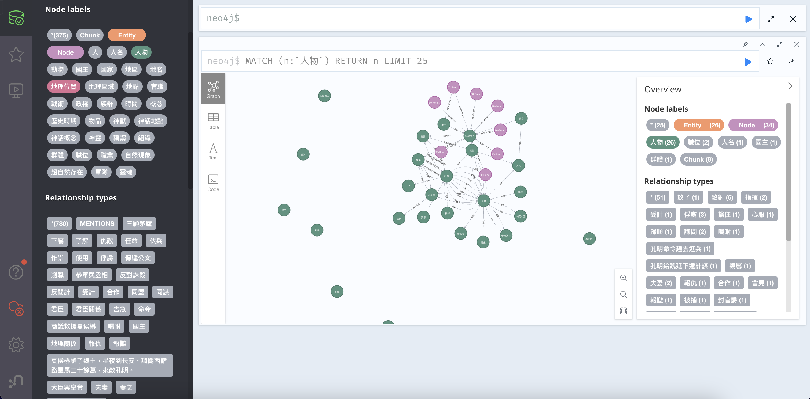

# knowledge Graph RAG and Evaluation

## Knowledge Graph RAG 部分有三

1. [0117-LangChain-KG-RAG](0117-LangChain-KG-RAG.ipynb)
    - 學長提供的拿來改
2. [0117-LlamaIndex-KG-RAG（失敗）](0117-LlamaIndex-KG-RAG.ipynb)
    - LlamaIndex 仿照 GraphRAG 的實作，但仍有差距。
    - 僅能執行到建立 KG 部分，無法進行問答。
    - 建立 Community 時失敗，卡到 Azure 的 暴力 filter。
3. [0117-GraphRAG](./GraphRAG/0117-GraphRAG.ipynb)
    - 微軟 GraphRAG

### 建構 KG 使用資料

- [三國演義第 90 回](./data/90-Romance-of-the-Three-Kingdoms.txt)
- [三國演義第 91 回](./data/91-Romance-of-the-Three-Kingdoms.txt)
- [三國演義第 92 回](./data/92-Romance-of-the-Three-Kingdoms.txt)

#### /data 其他檔案也試過

1. [dataset.txt](./data/dataset.txt)
    - GraphRAG 官方使用的一本小說，製作 Evaluation 資料集時發現不適合且太長。
2. [age-of-22.txt](./data/age-of-22.txt)
    - 網路複製幹文，這種較為口語且沒有明確表示說這句話的是誰，不利於 KG 建立。
    - 建立出來效果很差。
3. [school.txt](./data/school.txt)
    - 戰校複製文，與 age-of-22.txt 一樣，效果很差。

### 檢視 KG 建立成果

開好 docker 後把兩個 notebook 跑完。

[0117-LangChain-KG-RAG](0117-LangChain-KG-RAG.ipynb)：[Neo4j local 7474](http://localhost:7474/browser/)



[0117-LlamaIndex-KG-RAG（失敗）](0117-LlamaIndex-KG-RAG.ipynb)：[Neo4j local 7475](http://localhost:7475/browser/)



結論： `LlamaIndex版` 製作的 KG，node 節點比 `LangChain版` 少很多，並且節點切的也不適合。

## Evaluation 部分

使用 RAGAS，並且自建 Evaluation 資料集。

```plaintext
sample_queries = [
    "誰是祝融夫人？",
    "孟獲被諸葛亮第幾次擒住後才真心歸降？",
    "孔明用什麼方法平定了烏戈國的藤甲軍？",
    "趙雲在鳳鳴山與韓德及其四子交戰的結果如何？",
    "孔明如何智取南安城？",
]

expected_responses = [
    "祝融夫人是孟獲的妻子，南蠻祝融氏之後，善使飛刀，百發百中。",
    "孟獲被諸葛亮第七次擒住後才真心歸降，並誓不再反。",
    "孔明利用火攻之計，在盤蛇谷用火藥和火砲燒毀了烏戈國的藤甲軍。",
    "趙雲在鳳鳴山與韓德及其四子交戰，最終斬殺了韓德及其三子，並生擒了次子韓瑤。",
    "孔明利用崔諒和楊陵的內應計策，讓關興和張苞扮作安定軍馬進入南安城，最終擒住了夏侯楙。",
]
```